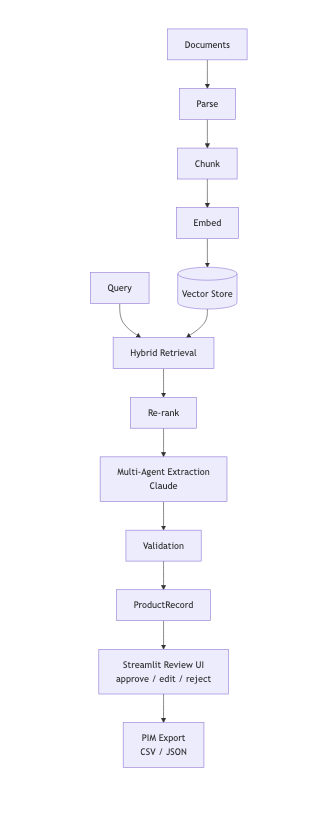

# MDM Advanced RAG — Product Attribute Extraction Pipeline

An end-to-end Retrieval-Augmented Generation pipeline that ingests product specification documents, extracts structured technical attributes using a multi-agent LLM framework, and routes results through a data steward review UI before export to PIM/E-commerce systems.



---

## Overview

Product technical specifications arrive in inconsistent formats (PDF, DOCX, Excel, HTML). This pipeline automates attribute extraction across thousands of documents by combining hybrid vector search with a five-agent Claude-powered extraction framework. Extracted records are stored in SQLite, reviewed via a Streamlit UI, and exported as PIM-ready CSV or JSON.

**Key capabilities:**

- Multi-format document ingestion (PDF, DOCX, XLSX, HTML, TXT/MD)
- Hybrid retrieval — dense (Qdrant ANN) + sparse (BM25) fused via Reciprocal Rank Fusion, then reranked by a local cross-encoder
- Five parallel extraction agents per document (identifiers, dimensions, electrical, materials, performance)
- Structured output enforced by `instructor` + Pydantic v2 — malformed LLM responses are automatically retried
- Checkpoint-based async batch runner — resume mid-run without reprocessing completed documents
- Streamlit review UI for approve / edit / reject workflow
- Flat CSV + JSON export ready for PIM import

---

## Architecture

```
┌─────────────────────────────────────────────────────────────────┐
│                        Ingestion Layer                          │
│  PDF / DOCX / XLSX / HTML / TXT  →  Parser  →  Chunker         │
│  →  OpenAI Embeddings  →  Qdrant (dense) + BM25 (sparse)       │
└─────────────────────────────────────────────────────────────────┘
                              │
                              ▼
┌─────────────────────────────────────────────────────────────────┐
│                       Retrieval Layer                           │
│  Query Decomposer  →  Dense + Sparse retrievers                 │
│  →  RRF Fusion  →  flashrank Reranker                           │
└─────────────────────────────────────────────────────────────────┘
                              │
                              ▼
┌─────────────────────────────────────────────────────────────────┐
│                      Extraction Agents                          │
│  IdentifiersAgent │ DimensionsAgent │ ElectricalAgent           │
│  MaterialsAgent   │ PerformanceAgent  (run in parallel)         │
│  →  Validator  →  Orchestrator  →  ProductRecord                │
└─────────────────────────────────────────────────────────────────┘
                              │
                              ▼
┌─────────────────────────────────────────────────────────────────┐
│                     Review & Export Layer                       │
│  SQLite (pending / approved / rejected / edited)                │
│  Streamlit UI  →  CSV / JSON PIM export                         │
└─────────────────────────────────────────────────────────────────┘
```

### Design decisions

**Hybrid retrieval** — Dense search finds semantically similar content; BM25 finds exact keyword matches like part numbers and model codes. RRF merges both ranked lists and the cross-encoder reranker rescores merged candidates. Together they outperform either method alone on technical documents.

**Per-document retrieval scoping** — Each extraction agent filters Qdrant by `document_id` so it only sees chunks from the target document, preventing cross-document attribute contamination.

**`instructor` for structured output** — Wraps the Anthropic SDK and enforces Pydantic model output from every LLM call. If Claude returns malformed JSON it automatically retries with an error correction prompt.

**Checkpoint-based batch processing** — `BatchExtractionRunner` writes each `ProductRecord` to SQLite immediately after extraction. If a run fails at document 3,000, restarting with `--resume` skips already-processed documents.

---

## Project Structure

```
MDM-Advanced-RAG/
├── config/
│   ├── settings.py               # All constants: paths, model names, thresholds
│   └── schema.py                 # Pydantic models (ProductRecord, AttributeValue)
├── ingestion/
│   ├── pipeline.py               # Selects parser, chunks output
│   ├── chunker.py                # RecursiveCharacterTextSplitter wrapper
│   └── parsers/
│       ├── base.py               # BaseParser ABC + ParsedDocument dataclass
│       ├── pdf_parser.py         # pdfplumber (tables as markdown) + pypdf fallback
│       ├── docx_parser.py        # python-docx
│       ├── excel_parser.py       # openpyxl, sheet-per-page
│       ├── html_parser.py        # BeautifulSoup, strips nav/footer noise
│       └── txt_parser.py         # Plain text / Markdown
├── embedding/
│   ├── embedder.py               # Batched OpenAI embedding calls with retry
│   └── indexer.py                # Qdrant upsert + search
├── retrieval/
│   ├── dense_retriever.py        # Vector similarity (Qdrant ANN)
│   ├── sparse_retriever.py       # BM25 (rank-bm25), persisted to disk
│   ├── hybrid_retriever.py       # RRF fusion + rerank
│   ├── reranker.py               # flashrank cross-encoder
│   └── query_decomposer.py       # LLM sub-query generation
├── agents/
│   ├── base_agent.py             # BaseExtractionAgent ABC + AgentResult model
│   ├── orchestrator.py           # Runs all agents per doc, merges into ProductRecord
│   ├── validator.py              # Cross-agent consistency + unit normalization
│   └── specialized/
│       ├── identifiers_agent.py  # Part numbers, SKUs, manufacturer
│       ├── dimensions_agent.py   # Physical dimensions + weight
│       ├── electrical_agent.py   # Voltage, current, IP rating
│       ├── materials_agent.py    # Materials, RoHS, certifications
│       └── performance_agent.py  # Temperature, accuracy, flow rate
├── rag/
│   ├── chain.py                  # Simple retrieve → Claude chain
│   └── advanced_chain.py         # Hybrid + rerank chain
├── workflow/
│   ├── review_store.py           # SQLite state (pending/approved/rejected/edited)
│   ├── batch_runner.py           # Async batch runner with checkpoint/resume
│   └── exporter.py               # PIMExporter → flat CSV + JSON
├── ui/
│   ├── app.py                    # Streamlit entry point
│   └── pages/
│       ├── 01_review_queue.py    # Approve / edit / reject extractions
│       ├── 02_approved.py        # Approved records read-only view
│       └── 03_export.py          # Export controls + download
├── scripts/
│   ├── ingest_sample.py          # Ingest a folder of documents into the vector store
│   ├── query_baseline.py         # Query the RAG pipeline from the CLI
│   └── run_batch.py              # Run full batch extraction
├── tests/
├── data/
│   ├── raw/                      # Original documents (gitignored)
│   ├── processed/                # Intermediate artifacts (gitignored)
│   └── exports/                  # Final CSV/JSON PIM exports
├── .env.example
├── requirements.txt
└── pyproject.toml
```

---

## Setup

### Prerequisites

- Python 3.11+
- Docker (for Qdrant)
- Anthropic API key
- OpenAI API key (embeddings)

### 1. Clone and install

```bash
git clone <repo-url>
cd MDM-Advanced-RAG
python -m venv .venv
source .venv/bin/activate   # Windows: .venv\Scripts\activate
pip install -r requirements.txt
```

### 2. Configure environment

```bash
cp .env.example .env
```

Edit `.env` and set:

```env
ANTHROPIC_API_KEY=sk-ant-...
OPENAI_API_KEY=sk-...
```

All other settings (model names, chunk sizes, retrieval parameters) are configurable in [config/settings.py](config/settings.py) or via environment variables.

### 3. Start Qdrant

```bash
docker run -p 6333:6333 qdrant/qdrant
```

> **No Docker?** See [Chroma Fallback](#chroma-fallback) below.

---

## Usage

### Ingest documents

Place source documents in `data/raw/`, then run:

```bash
python scripts/ingest_sample.py --dir data/raw --limit 20
```

### Query the pipeline

```bash
python scripts/query_baseline.py "What is the operating temperature range for product X?"
```

### Run batch extraction

```bash
# Full run (resumes automatically if interrupted)
python scripts/run_batch.py --concurrency 5

# Subset for testing
python scripts/run_batch.py --limit 100 --concurrency 5
```

### Launch the review UI

```bash
streamlit run ui/app.py
```

Open [http://localhost:8501](http://localhost:8501). The UI has three pages:

| Page | Purpose |
|------|---------|
| **Review Queue** | Approve, edit, or reject pending extractions |
| **Approved** | Read-only view of approved records |
| **Export** | Download CSV or JSON for PIM import |

---

## PIM Attribute Schema

Each extracted attribute is stored as an `AttributeValue` with a value, unit, confidence level, and source chunk IDs for full traceability.

| Group | Attributes |
|-------|-----------|
| **Identifiers** | `part_number`, `sku`, `gtin`, `manufacturer_name`, `product_family`, `revision` |
| **Physical Dimensions** | `length`, `width`, `height`, `depth`, `weight`, `diameter` |
| **Electrical Specs** | `voltage_input`, `voltage_output`, `current_rating`, `power_consumption`, `frequency`, `ip_rating` |
| **Materials & Compliance** | `primary_material`, `finish`, `rohs_compliant`, `reach_compliant`, `certifications` |
| **Performance Metrics** | `operating_temp_min/max`, `storage_temp_min/max`, `accuracy`, `flow_rate`, `pressure_rating` |

**Confidence levels:**

| Level | Meaning |
|-------|---------|
| `high` | Value appears verbatim and unambiguously in the source text |
| `medium` | Value inferred from context or in an unusual format |
| `low` | Best guess — source is ambiguous or partial |

The flat CSV export uses double-underscore column names:

```
physical_dimensions__length__value
physical_dimensions__length__unit
physical_dimensions__length__confidence
...
```

---

## Key Dependencies

| Package | Purpose |
|---------|---------|
| `anthropic` + `instructor` | LLM calls with enforced structured output |
| `openai` | Text embeddings (`text-embedding-3-small`) |
| `qdrant-client` | Vector store |
| `pdfplumber`, `python-docx`, `openpyxl`, `beautifulsoup4` | Document parsing |
| `rank-bm25` | Sparse BM25 retrieval |
| `flashrank` | Local cross-encoder reranking |
| `langchain-text-splitters` | Recursive text chunking |
| `pydantic` v2 + `pydantic-settings` | Schema validation and config |
| `streamlit` | Data steward review UI |
| `tenacity` | Retry with exponential backoff |
| `loguru` | Structured logging |
| `pytest` | Test suite |

---

## Running Tests

```bash
pytest tests/ -v
```

---

## Chroma Fallback

If Qdrant is unavailable, `VectorIndexer` can be swapped for a Chroma-backed implementation. Both expose the same `upsert` / `search` interface. Hybrid search is not natively supported in Chroma — the BM25 leg still runs independently and results are fused in Python.

```bash
pip install chromadb
```

Set in `.env`:

```env
VECTOR_BACKEND=chroma
```
